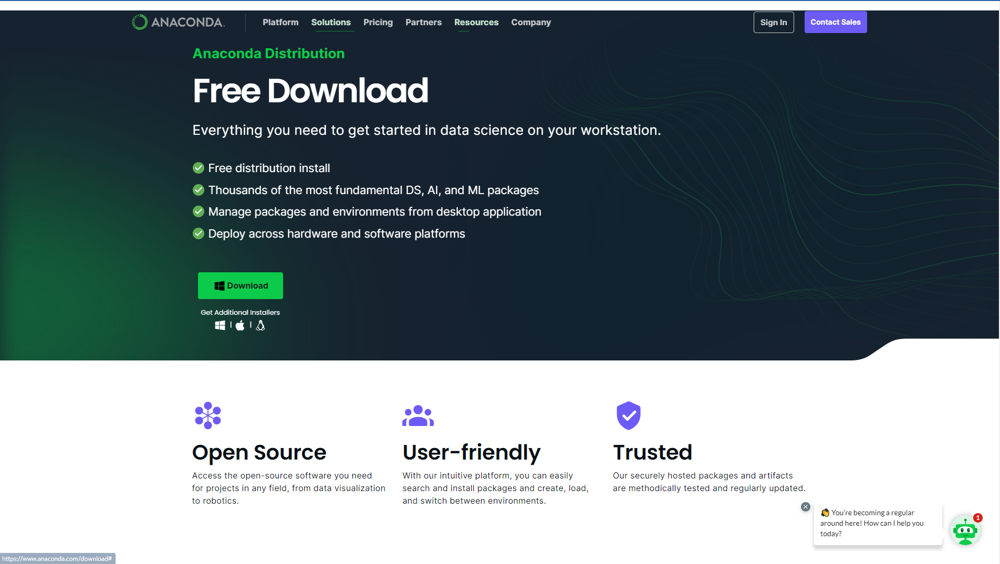
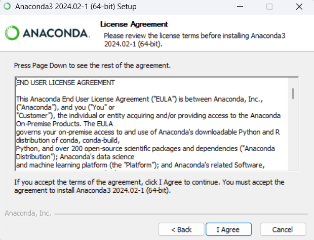
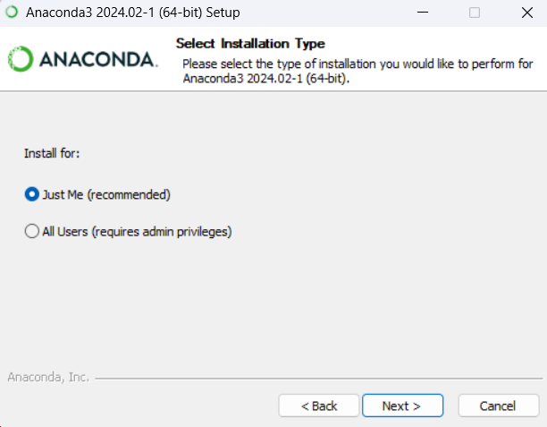
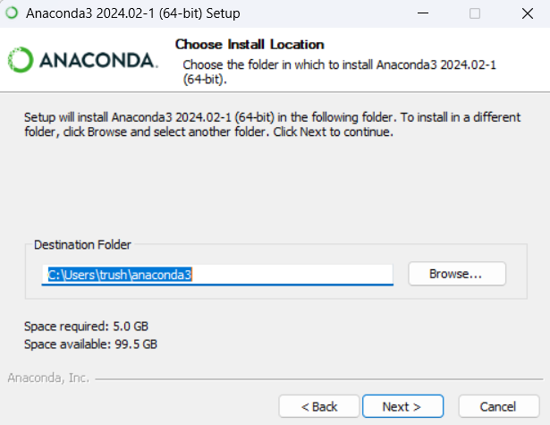
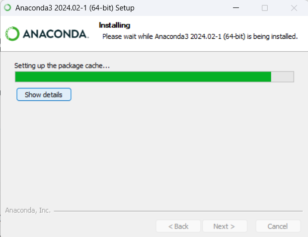
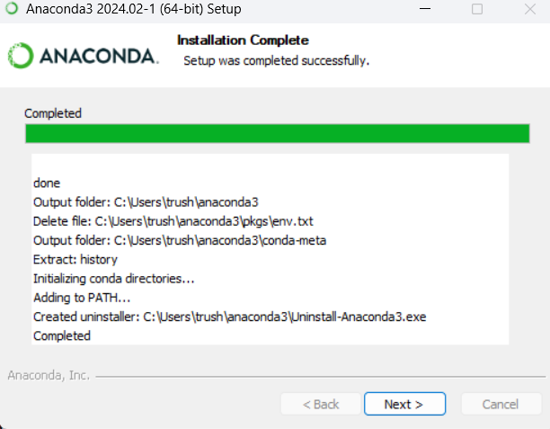
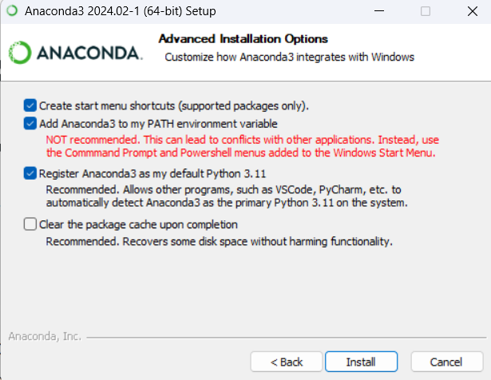
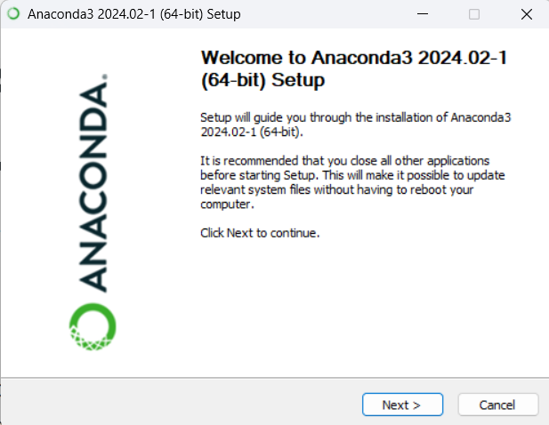

# Anaconda

### 1. Download [Anaconda](https://www.anaconda.com/download) Navigator from their website:

### 2. Agree User License:

### 3. Select All Users if admin privileges available:

### 4. Use default installation location:

### 5. It will take couple of minutes to install:

### 6. After installation is complete continue to next step:

### 7. Add Anaconda3 to PATH environment:

### 8. Finsh Setup:

