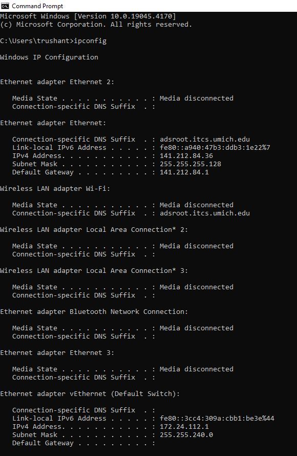
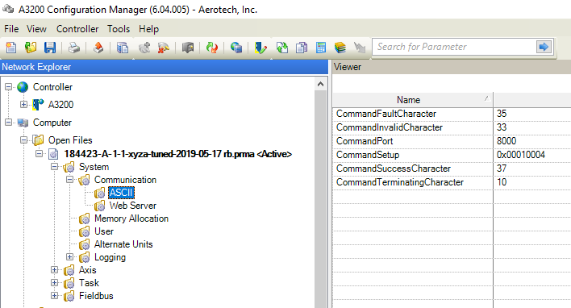

# Stages Overview

<p align="justify"> Codebase to control stages resides in <b>src -> stages -> stage_control.py</b> and the configuration file resides in <b> config -> stages.yaml </b>. First step would be to modify parameters in teh <b> stages.yaml </b> file which are as follow:
</p>

- connection:
    - PC_IP_ADDRESS: "000.000.00.00"
    - PORT: 0000
    - SOCKET_TIMEOUT: 600
- mode:
    - incremental: True
- substrate:
    - GLASS: 0
    - SILICON: 1

Note: There are some parameters for Safety Zone which will be implemented later.

### 1. Extract IP address of current host computer attached to stages:
Open command prompt and use following command:
```
ipconfig
```



From the output use Ethernet adapter's IPv4 Address.

### 2. Get Port for ASCII server:
Open A3200 Configuration Manager and in the left pane go to following parameter:

**config_file -> System -> Communication -> ASCII -> CommandPort**



Note: Keep all other parameters default for now.
